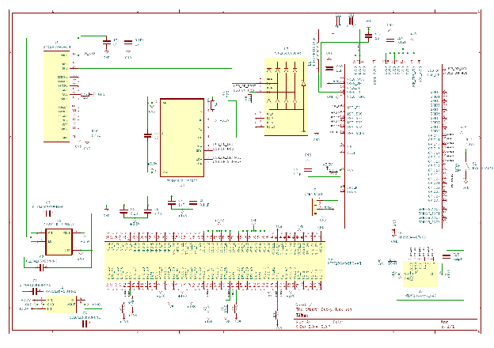
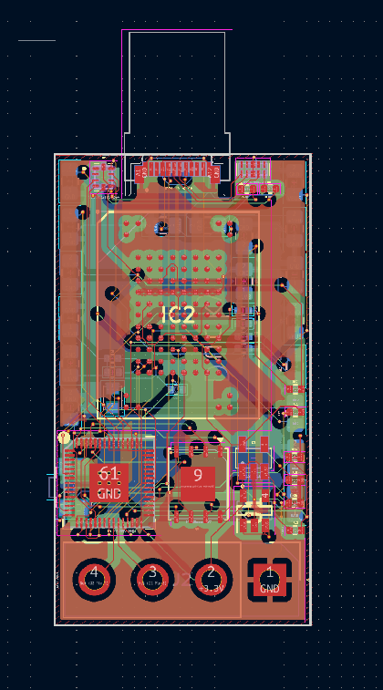
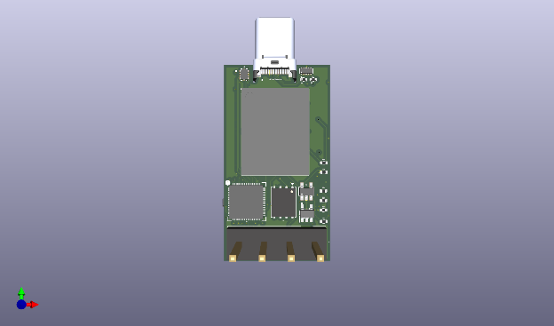
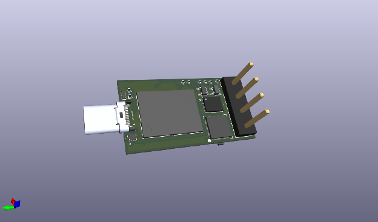
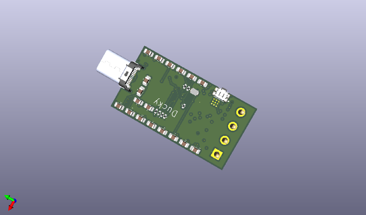
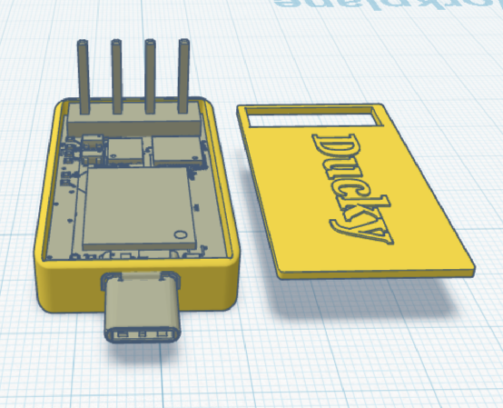

# Super-Ducky
# RP2350A Dual-Mode USB Device

## 1. Description

This project is a custom USB storage and control device powerd by the **Raspberry Pi RP2350A** microcontroller. It serves as a dualmode device separating system firmware from user data through a highspeed EMMC interface

The system architecture utilizes a 4-layer PCB to maintain signal integrity for high-speed digital lines (USB and eMMC).

| Component | Function |
| :---- | :---- |
| **RP2350A** | Central MCU handling USB stack and storage logic |
| **eMMC (16GB)** | High density mass storage for user data |
| **QSPI Flash** | Dedicated firmware and bootloader execution |
| **LDO Regulators** | AP2112K series for stable 1.8V and 3.3V rails |
| **USB Mux** | TS3USB221 for signal routing and integrity |

## 2. Why I Built This

I built this project to explore **full stack embedded system development**.

Most beginner projects focus only on firmware or simple microcontroller boards. This project instead focuses on the **entire engineering process** including:

- **Hardware Architecture:** Designing a system that separates firmware execution (QSPI) from high-capacity storage (eMMC).
- **Advanced Sourcing:** Navigating global supply chains to source specialized ICs like the MTFC16GAKAEDQ-AIT eMMC via JLCPCB Global Sourcing.
- **High-Speed Design:** Learning to route differential USB pairs and high-clock-rate storage interfaces on a multi-layer board.
- **Power Management:** Implementing a multi-rail (3.3V/1.8V) system to satisfy different logic level requirements.

The goal was to move beyond hobbyist "breadboarding" and understand how professional-grade embedded products are engineered from the ground up.

## 3. How to Use the Device

1. **Connection:** Connect the device to a computer using a standard USB-C cable.
2. **Standard Operation:** The RP2350A initializes, loads firmware from the QSPI flash, and mounts the eMMC as a storage drive or serial device depending on the firmware configuration.
3. **Boot Selection:** To update firmware or change modes, hold the **Boot Button (GPIO22)** while plugging in the device. This forces the RP2350A into its native USB bootloader mode.
4. **Data Access:** Once connected, the host computer interacts with the 16GB eMMC through the high-speed USB interface managed by the MCU.

## 4. Hardware Visualization

### Full Schematic

### PCB Layout

### 3D Render

### BOM

## 5. Bill of Materials (BOM)

The following table lists all 20 parts required for the assembly, consolidated from the design files and JLCPCB procurement logs.

| Parts Type | JLCPCB Part \# | MFR Part \# | Link | Description | Unit Price | Qty | Total Price |
| :---- | :---- | :---- | :---- | :---- | :---- | :---- | :---- |
| stock | C1711 | CL21B104KBCNNNC | https://jlcpcb.com/partdetail/2063-CL21B104KBCNNNC/C1711 | 100nF 50V X7R ±10% 0805 Multilayer Ceramic Capacitors MLCC \- SMD/SMT ROHS | 0.0062 | 16 | 0.1 |
| stock | C8429 | WJ2EDGV-5.08-04P-14-00A | https://jlcpcb.com/partdetail/8923-WJ2EDGV\_5\_08\_04P\_1400A/C8429 | \-40℃\~+105℃ 1 10A 1x4P 300V 4 4P 5.08mm Board Side/Socket \- Open Green Hinged (Snap On) Through Hole Plugin,P=5.08mm Pluggable System Terminal Block ROHS | 0.0905 | 2 | 0.19 |
| stock | C1779 | CL21A475KAQNNNE | https://jlcpcb.com/partdetail/2131-CL21A475KAQNNNE/C1779 | 25V 4.7uF X5R ±10% 0805 Multilayer Ceramic Capacitors MLCC \- SMD/SMT ROHS | 0.0143 | 2 | 0.03 |
| buy | C6006988 | UP31-CV-G-CM | https://jlcpcb.com/partdetail/CUI-UP31\_CV\_GCM/C6006988 | \- USB Connectors ROHS | 2.265 | 4 | 9.06 |
| stock | C71617 | CRCW040210K0FKED | https://jlcpcb.com/partdetail/VishayIntertech-CRCW040210K0FKED/C71617 | \-55℃\~+155℃ 10kΩ 50V 63mW Thick Film Resistor ±1% ±100ppm/℃ 0402 Chip Resistor \- Surface Mount ROHS | 0.0035 | 6 | 0.03 |
| buy | C100612 | CR0402JF0220G | https://jlcpcb.com/partdetail/LIZElec-CR0402JF0220G/C100612 | \-55℃\~+125℃ 22Ω 50V 62.5mW Thick Film Resistor ±200ppm/℃ ±5% 0402 Chip Resistor \- Surface Mount ROHS | 0.0003 | 10000 | 3 |
| stock | C25905 | 0402WGF5101TCE | https://jlcpcb.com/partdetail/26648-0402WGF5101TCE/C25905 | \-55℃\~+155℃ 5.1kΩ 50V 62.5mW Thick Film Resistor ±1% ±100ppm/℃ 0402 Chip Resistor \- Surface Mount ROHS | 0.0008 | 4 | 0.01 |
| stock | C25792 | 0402WGF4702TCE | https://jlcpcb.com/partdetail/26535-0402WGF4702TCE/C25792 | \-55℃\~+155℃ 47kΩ 50V 62.5mW Thick Film Resistor ±1% ±100ppm/℃ 0402 Chip Resistor \- Surface Mount ROHS | 0.0008 | 10 | 0.01 |
| stock | C25530 | 0402WGJ0104TCE | https://jlcpcb.com/partdetail/26273-0402WGJ0104TCE/C25530 | \-55℃\~+155℃ 100kΩ 50V 62.5mW Thick Film Resistor ±100ppm/℃ ±5% 0402 Chip Resistor \- Surface Mount ROHS | 0.0006 | 4 | 0.01 |
| stock | C25076 | 0402WGF1000TCE | https://jlcpcb.com/partdetail/25819-0402WGF1000TCE/C25076 | \-55℃\~+155℃ 100Ω 50V 62.5mW Thick Film Resistor ±1% ±100ppm/℃ 0402 Chip Resistor \- Surface Mount ROHS | 0.0008 | 2 | 0.01 |
| stock | C1712 | CL21B105KAFNFNE | https://jlcpcb.com/partdetail/2064-CL21B105KAFNFNE/C1712 | 1uF 25V X7R ±10% 0805 Multilayer Ceramic Capacitors MLCC \- SMD/SMT ROHS | 0.0133 | 18 | 0.24 |
| stock | C138714 | TPD4E05U06DQAR | https://jlcpcb.com/partdetail/TexasInstruments-TPD4E05U06DQAR/C138714 | \-40℃\~+125℃ 0.5pF 10nA 14V 2.5A@8/20us 4 40W@8/20us 5.5V 6.5V ESD IEC 61000-4-2、IEC 61000-4-5、IEC 61000-4-4 Unidirectional USON-10(1x2.5) ESD and Surge Protection (TVS/ESD) ROHS | 0.072 | 2 | 0.15 |
| stock | C295091 | XJHCELNANF-12MHZ | https://jlcpcb.com/partdetail/TAITIENElec-XJHCELNANF12MHZ/C295091 | \-40℃\~+85℃ 12MHz 20pF Crystal Oscillator ±30ppm ±30ppm HC-49S-SMD Crystals ROHS | 0.1385 | 2 | 0.28 |
| stock | C176944 | AP2112K-1.8TRG1 | https://jlcpcb.com/partdetail/DiodesIncorporated-AP2112K\_18TRG1/C176944 | \-40℃\~+85℃@(Ta) 1 1.8V 500mV@(600mA) 50uVrms 55uA 600mA 65dB@(1kHz) 6V Fixed Over Current Protection、Over Temperature Protection、Enable Positive SOT-25 Voltage Regulators \- Linear, Low Drop Out (LDO) Regulators ROHS | 0.1103 | 2 | 0.23 |
| stock | C128396 | TS3USB221ARSER | https://jlcpcb.com/partdetail/TexasInstruments-TS3USB221ARSER/C128396 | \-40℃\~+85℃ 12ns 2.3V\~3.6V 250ps 2:1 30ns 6pF 6Ω 900MHz USB UQFN-10(1.5x2) Analog Switches \- Special Purpose ROHS | 0.2515 | 2 | 0.51 |
| stock | C79167 | EVQP7A01P | https://jlcpcb.com/partdetail/PANASONIC-EVQP7A01P/C79167 | \-20℃\~+70℃ 1.35mm 100,000 cycles 12V 2.2N 3.55mm 3.5mm 50mA PC Pin Rectangular Button SPST Surface Mount, Right Angle SMD,3.6x3.5mm Tactile Switches ROHS | 0.1539 | 2 | 0.31 |
| stock | C42411118 | RP2350A | https://jlcpcb.com/partdetail/RaspberryPi-RP2350A/C42411118 | QFN-60-EP Microcontrollers (MCU/MPU/SOC) ROHS | 1.2406 | 2 | 2.49 |
| stock | C2613930 | W25Q128JVSIM | https://jlcpcb.com/partdetail/WinbondElec-W25Q128JVSIM/C2613930 | \-40℃\~+85℃ 100,000 cycles 10uA 128Mbit 133MHz 150ms@(64KB) 2.7V\~3.6V 20 Years 400us SPI SOIC-8-208mil NOR FLASH ROHS | 3.2212 | 2 | 6.45 |
| stock | C23380830 | AP2112K-3.3TRG1 | https://jlcpcb.com/partdetail/TECHPUBLIC-AP2112K\_33TRG1/C23380830 | \-40℃\~+85℃@(Ta) 1 10uA 3.3V 320mV@(600mA) 5.5V 600mA 75dB@(1kHz) Fixed Over Temperature Protection Positive SOT-23-5 Voltage Regulators \- Linear, Low Drop Out (LDO) Regulators ROHS | 0.1029 | 2 | 0.21 |

| Parts Type | JLCPCB Part \# | Digikey-ID | MFR Part \# | Description | Unit Price | Qty | Total Price |
| :---- | :---- | :---- | :---- | :---- | :---- | :---- | :---- |
| overseas\_shop | C30839157 | digikey \#: 557-1967-1-ND | MTFC16GAKAEDQ-AIT TR | IC FLASH 128GBIT MMC 100LBGA | 41.6132 | 2 | 83.23 |
***

## 6. Billing Summary

Total expenditure for PCB fabrication, assembly, and parts based on project records.

| Category | Cost (INR) | Cost (USD) |
| :---- | :---- | :---- |
| **JLCPCB Assembly (PCBA)** | ₹6,621.82 | $72.84 |
| **Component Sourcing (Global \+ Stock)** | ₹9686.36 | $106.55 |
| **Grand Total** | **₹16308.18** | **$179.39** |
